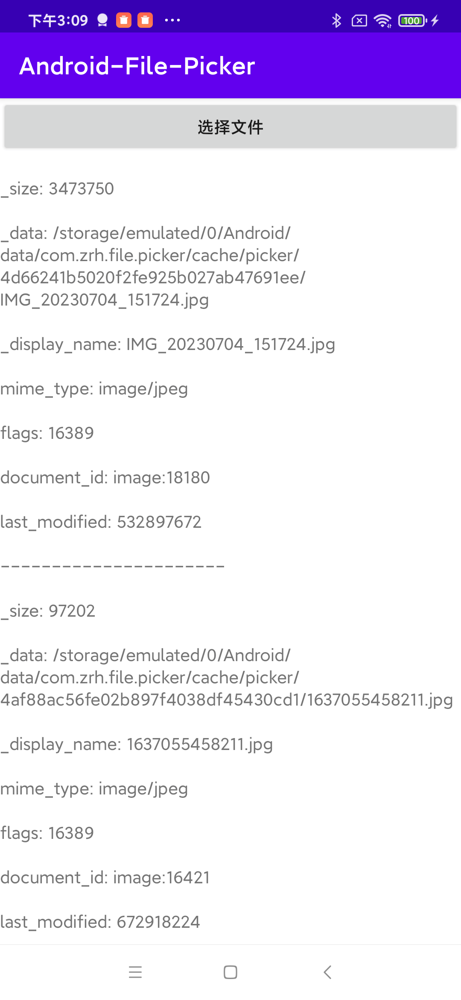

# Android-File-Picker

Android系统文件选择器，基于Activity Result Api实现，简单易用。


### 使用步骤

#### 1.下载AAR并添加到项目中。

[下载地址](https://github.com/zrheasy/Android-File-Picker/releases/download/v1.0.0/file-picker-v1.0.aar)

```groovy
implementation fileTree(dir: 'libs', include: ['*.jar', '*.aar'])
```

#### 2.代码中调用FilePicker.pick()方法选择文件。

```kotlin
FilePicker.pick(this, FilePickOptions(), object : FilePickCallback {
    override fun onResult(data: List<Uri>) {
        // handle uri
    }

    override fun onError(code: Int, msg: String) {
        // handle error
    }
})
```

### 3.设置FilePickOptions，支持文件类型和多选。

```kotlin
val options = FilePickOptions()
options.mimeType = "image/*"
options.allowMultiple = true
```

### 4.查询文件信息。

```kotlin
val fields = UriUtils.getMetaInfo(this, uri)
```

### 5.获取文件（将文件流导入到应用cache目录下）。

```kotlin
 val file = UriUtils.getFileFromUri(this, uri, File(cache, "picker"))
```